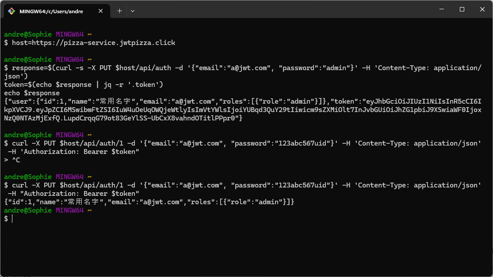
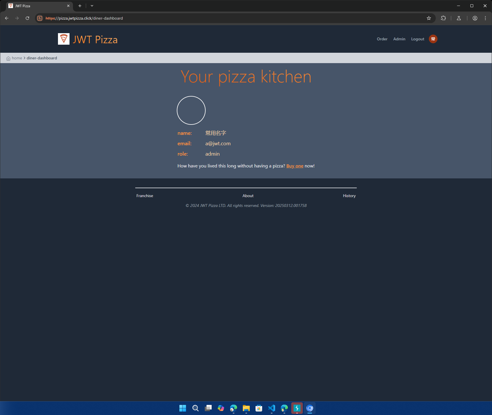
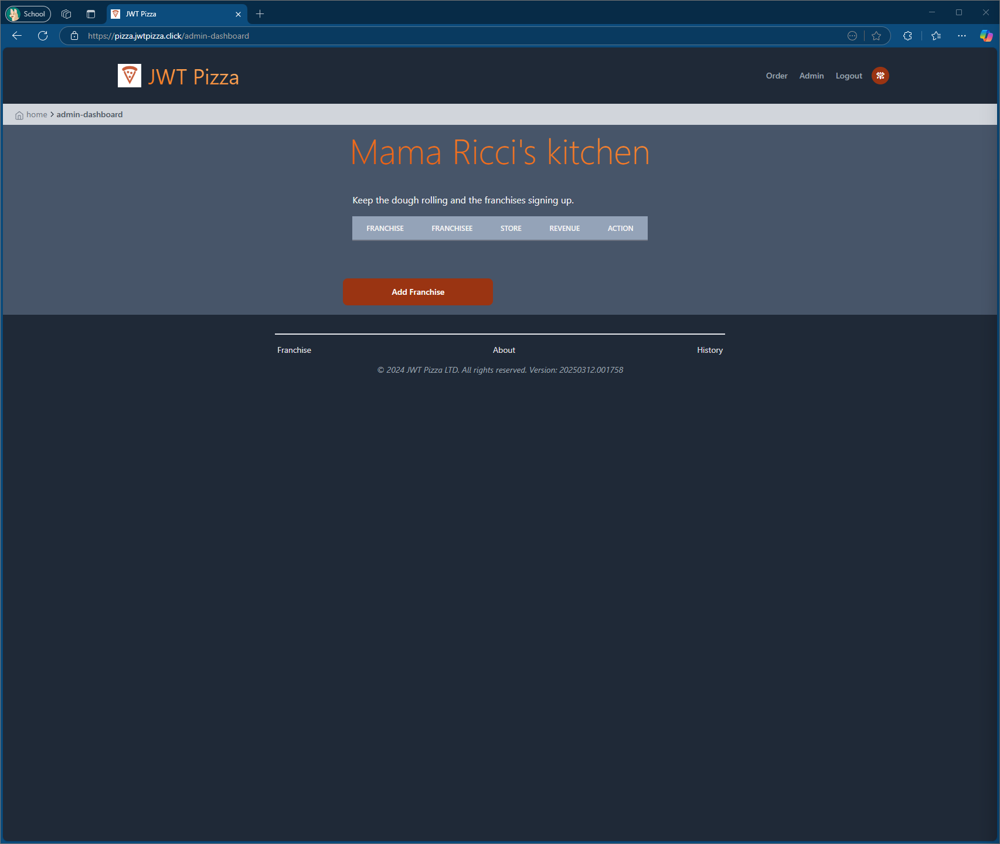
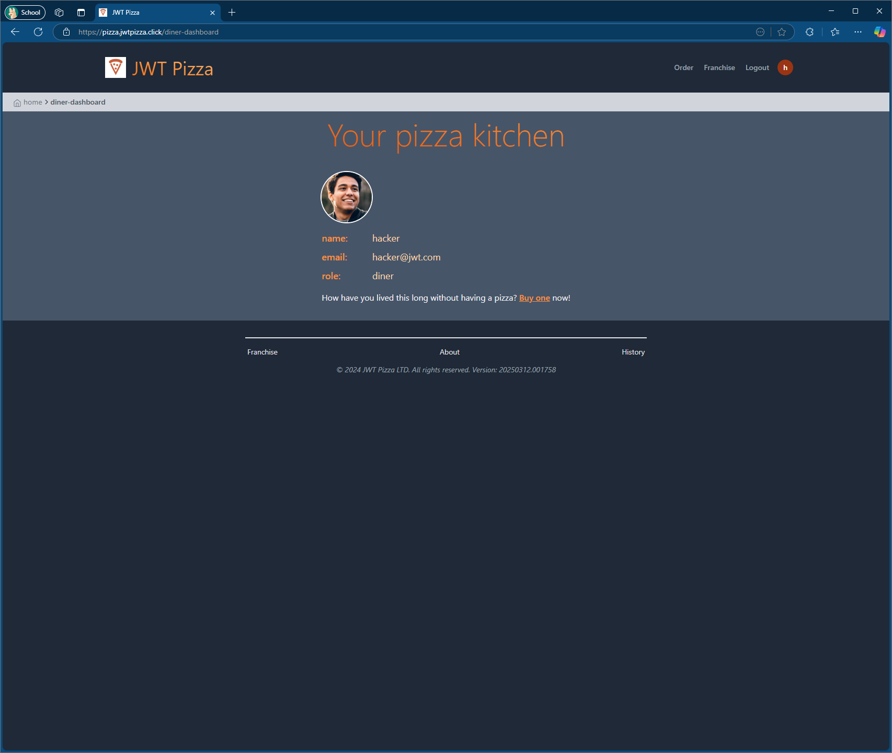

# Peer Penetration testing:

Andrew Redd attacking Vincent Reiley

### Peer successful attack record

| Item           | Result                                                                         |
| -------------- | ------------------------------------------------------------------------------ |
| Date           | April 12, 2025                                                                 |
| Target         | pizza.jwtpizza.click                                                           |
| Classification | Security Misconfiguration                                                      |
| Severity       | 2                                                                              |
| Description    | Administrator Credentials set to default and hidden methods accessible from console to change defaults|
| Images         |    Changed Admin Password to alphanumeric password to avoid easily breaking it.  Logged Into Default Admin Deleting Franchises|
| Corrections    | lots of the vulnerabilities come from the updateUser method in the database.js it really only can be accessed by curl calls at an administrator level. A correction I used in my personal deployment was to change my admin password to something alphanumeric so it wouldn't be easily tested or guessed using Turbo Intruder or Intruder from Burp Suite then I disabled updateUser in my deployment when we were pair penetration testing so it wouldn't be exploited if my password could be guessed to actually change it and lock me out of my system.|

### Peer Failed attack record

| Item           | Result                                                                         |
| -------------- | ------------------------------------------------------------------------------ |
| Date           | June 12, 2053                                                                  |
| Target         | pizza.jwtpizza.click                                                           |
| Classification | Injection                                                                      |
| Severity       | 4                                                                              |
| Description    | Attempted SQL injection into password during registration and login to change a new user into an administrator|
| Images         |    I believe there is a vulnerability in the way a user is logged in using the token and userID. Failed to exploit it|
| Corrections    | Sanitize user inputs. I attempted some sql injection to add a value of 1 for the user ID to make a new administrator but due to my unfamiliarity with sql injection I was unable to exploit the vulnerability in the time we agreed on for our peer testing|

